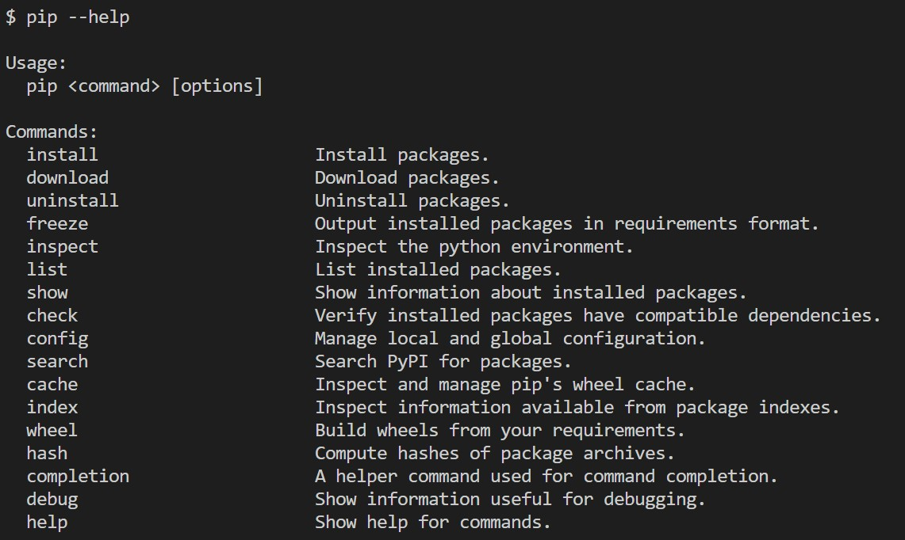

# Звіт до роботи № 4
## Тема: _Робота з віртуальнимим середовищами_
### Мета роботи: _Навчитись створювати та працювати у віртуальних середовищах Python_
---
### Виконання роботи
- Результати виконання завдання:
    1. Створили віртуальне середовище за допомогою venv та pipenv. Створені [Pipfile](./Pipfile) та [Pipfile.lock](./Pipfile.lock);
    1. Створено програму яка буде працювати у віртуальних середовищах. Код програми представлено у файлі [my.py](./my.py);
    1. Навчились створювати та працювати у віртуальних середовищах;
- вставлені рисунки (скріншоти екрана або фотографії виконаного завдання у зошиті);
> якщо графічних файлів багато то краще помістити їх у окрему папку, наприклад у мене це папка `pictures`. Уважно дивіться коли вставляєте URL - файл має бути представленим як `raw`. 

- результати виконання індивідуального завдання:
    - робимо завдення із зірочкою, наприклад показуємо що можна робити за допомогою команди pip
    

### Висновок: 
> у висновку потрібно відповісти на запитання:
- :question: Що зроблено в роботі;
- :question: Чи досягнуто мети роботи;
- :question: Які нові знання отримано;
- :question: Чи вдалось відповісти на всі питання задані в ході роботи;
- :question: Чи вдалося виконати всі завдання;
- :question: Чи виникли складності у виконанні завдання;
- :question: Чи подобається такий формат здачі роботи (Feedback);
- :question: Побажання для покращення (Suggestions);
---